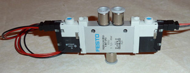

# Pneumatics

## Basics

Pneumatic components provide a strong complement to motors and gearboxes for various actuations. Once again, it is our job as programmers to convert the commands of the drive team into physical movement on the robot. 

Reasons to use pneumatics over motors include simplicity, ruggedness, and consistent, fast actuations. However, a disadvantage would be the time it takes to compress air. Actuations will also either be all the way in, or all the way out -- this is a consequence of simplicity. This concept should be made more clear in the [Example](#Example) section below.

## Components

The following section consists of descriptions for the main elements of a basic FRC pneumatic system.

### Cylinders

Pneumatic cylinders are devices that use compressed gas to perform actuations with linear force--in other words, they can push or pull things. For our purposes, there are two main types of cylinders: single-acting and double-acting.

 

(Source: https://en.wikipedia.org/wiki/Pneumatic_cylinder)

In a simple single-acting cylinder, the working fluid (air) acts only on one side of the piston. The cylinder will extend only when the pressurized air is put into it; once the pressure is released, a device such a spring will push the piston backwards, thus retracting the cylinder, as shown on the left.

A double-acting cylinder works similarly to a single-acting one in that it requires air on one side to move the internal piston. In this type, however, the air can work alternately on both sides, therefore controlling both extension and retraction. On the right, air retracts the cylinder instead of a spring.

### Solenoids

A solenoid is a device that essentially converts certain electrical signals into control of the air going into a *cylinder*. The types of solenoids include *single* and *double*: a single solenoid has a default position (e.g. cylinder retracted) that changes only when voltage is supplied (cylinded extended). When voltage is removed, the extended cylinder then retracts. Say that at the end of a match we have an intake mechanism with two single-acting cylinders extended while connected to single solenoids. Once the robot stops commanding/powering the solenoids, the cylinders will gradually return to their default positions.

On the other hand, a double solenoid has two solenoids, and when we apply voltage to just one of them, the cylinder shifts in the corresponding direction. The double solenoid works like a light switch--the solenoid will use power to go to one position, but will stay there until the opposite solenoid is powered, thus flipping the "switch."

1257 used *three-way, two-position* solenoids in their 2019 climb system. Along with the capabilities of a basic double solenoid, this device allows air to act on both sides/directions simultaneously, such that the cylinder can be "frozen" in a position.

### Compressor & PCM

 

An air compressor gathers the pressurized air needed to power our pneumatic actuations. It is controlled by a pressure switch that tells it to automatically shut-off at certain point in order to conserve battery power.

The *Pneumatic Control Module* is an electronic interface used to control the compressor, solenoid(s), and pressure switch once it is wired up to the RoboRIO correctly. It can control **eight** single solenoid valves or **four** double solenoid valves.

## Example

(Source: https://www.youtube.com/watch?v=JlKwRAvDue8)

As mentioned above, pneumatic mechanisms are great for linear motion that maintain constant force. A prime example of this would be Team 2056's (OP Robotics) 2019 hatch panel intake, as pictured above.

- Utilizes four pneumatic cylinders that enable quick pickup and placing of hatches.
- Two cylinders control the beak (pictured in the center). These two stay extended so that the beak move into a hatch, and then they are retracted in order to open up the beak and hold the hatch.
- The whole process is undone to *place* a disc: the beak-cylinders are extended, freeing the panel, and the two larger cylinders on the side are extended to push the panel onto the target.

This mechanism is an example of how actuations can be only "fully in" or "fully out." The beak cannot be opened midway, opened at certain speed, etc. Overall, though, 2056's intake is a very efficient usage of pneumatic cylinders that allows for consistent actuations.

---

## Programming: Setup and Control

We can now translate the basics of pneumatics into our robot program. Doing so isn't too difficult.

Initializing and commanding solenoids in the program is similar to how we did in the [Motors.md](https://frc1257.github.io/robotics-training/#/frc/1-Basics/2-Motors) section. Two things must be known before creating our program, however: whether *single* or *double* solenoids are being used, and also the respective ID port numbers on the PCM. Here's what we'll do:

- `Solenoid solenoid;` or `DoubleSolenoid doubleSolenoid;`
  - Declare Solenoid and DoubleSolenoid objects
- `solenoid = new Solenoid(SINGLE_SOLENOID_ID);` or `doubleSolenoid = new DoubleSolenoid(DOUBLE_SOLENOID_FORWARD, DOUBLE_SOLENOID_REVERSE);`
  - Initialize the objects with IDs(two IDs for a double solenoid, one each for the forward and reverse channels). Once again, remember that IDs should be constants referenced from `ElectricalLayout` in `Constants.java`.

Controlling the solenoid is just as simple as controlling a motor:

- `solenoid.set(true);` - set to "true" direction
- `solenoid.set(false);` - set to "false" direction
- `doubleSolenoid.set(Value.kForward);` - set to "forward" direction
- `doubleSolenoid.set(Value.kReverse);` - set to "reverse" direction
- `doubleSolenoid.set(Value.kOff);` - neither channel is activated, hence "off"**

> [!NOTE]
> Ff we were using three-way solenoids, `Value.kOff` would freeze the cylinder in position at the time. We actually used these in 2019 for our climb!

---

Just like before with motors, all of this can be organized and expanded upon into a subsystem class. More on that to follow!
