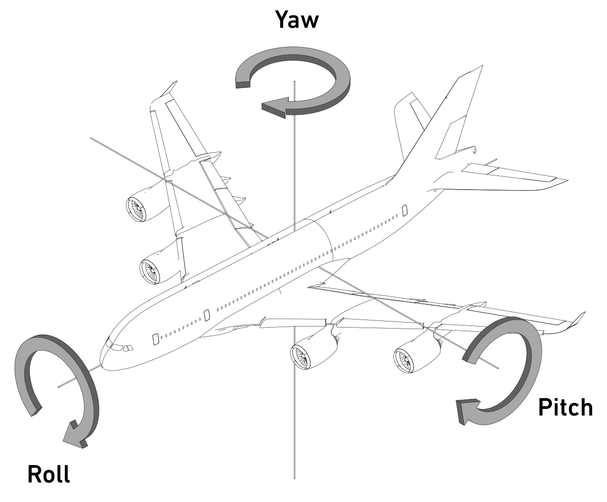

# Sensors Overview

One of the first ways we can augment our robot is including sensors, or devices that measure values with our robot. For instance, we can have sensors that measure angles, position, distance, and velocity. There are different sensors that do various things, and we will go over some of them here.

## Encoders

These are the most widely used sensors in FRC, and they attach to a motor to measure the number of revolutions they perform. Many encoders have different units, so it is important to consider that when we program them. For instance, the CTRE SRX MAG Encoder has 4096 units per revolution, while REV Robotics NEO Brushless Motors measure revolutions directly on the motor shaft.

Encoders can be super useful, especially when you do the math to convert those revolutions to a tangible results. For instance, by measuring the gear ratios and the radius of wheels, you can convert revolutions to values such as height or distance traveled.

## Gyroscope

Gyroscopes are devices that determine the angle that the robot is oriented. There are 3 dimensions that the gyroscope can rotate in: yaw, pitch, and roll.

These are really useful for turning to precise angles and determining the robot's heading relative to the field. The gyroscope can also frequently return values such as angular velocity (mostly through just differentiating the angle measurement).

The gyroscope that we use most of the time is the NavX-MXP board, which is a gyroscope combined with an accelerometer, a sensor that can measure acceleration and velocity. We do not use the accelerometer very often, however, as it can be inaccurate.

## Limit / Bump Switches

Limit / bump switches are sensors that contain a button / lever and returns a boolean of whether or not these buttons are currently being pressed / triggered. We frequently use these at the limits of our motion to ensure that the mechanism does not slam into hardware stops and stall. Instead, we put limit switches to prevent the arm from moving into hardware stops.

## Break Beam Sensors

Break beam sensors consist of a transmitter and a receiver. The transmitter transmits a beam to the receiver as long as the path is clear. If any object breaks the beam, the receiver will see that the beam is broken and send this to the robot. These are useful for detecting if an object is in the way and having the robot act accordingly.
