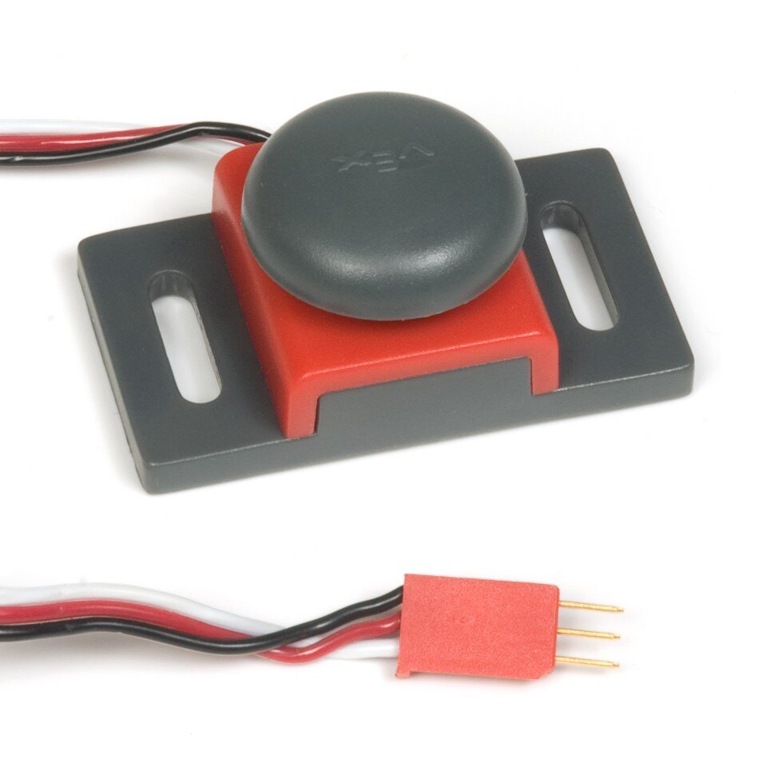

# Limit Switches / Break Beams

## Limit Switch

A sensor that we frequently use is a limit switch, which is essentially either a mechanical or magnetic switch that triggers when something happens.

There are a great variety of switches, but one that we have used in the past is a bump switch, which looks something like this:



When the switch is pressed, the sensor will return `true` and when not, the sensor will return `false`.

## Break Beam Sensors

Break beam sensors are another type of sensor that essentially create an invisible beam between a transmitter and a receiver. When the beam is not broken, the sensor returns `true` and when it is, the sensor returns `false`.

## Programming

The way that we use these two sensors (and pretty much all sensors that return booleans) is that we use a class from WPILib called `DigitalInput`. To do so, we first need to know the DIO part on the RoboRIO that the sensor is plugged into. We can get this information from electronics and it will most of the time be somewhere from 0 through 2.

We simply need to make a `DigitalInput` object inside of our subsystem's class and pass in the ID in the constructor.

```java
import static frc.robot.Constants.ElectricalLayout.*;

public class Arm extends SnailSubsystem {
    ...

    DigitalInput limitSwitchBottom;

    public Arm () {
        limitSwitchBottom = new DigitalInput(ARM_LIMIT_SWITCH_PORT_ID); // port defined in Constants
    }
}
```

Then, if we want to access it, we can use `limitSwitchBottom.get()`, which will return the boolean as dictated above.

```java
public class Arm extends SnailSubsystem {
    ...

    @Override
    public void outputValues() {
        SmartDashboard.putBoolean("Arm Limit Switch Bottom", limitSwitchBottom.get());
    }
}
```

**Remember that the limit switch and the break beam sensors have different conditions for when they return true or not. The limit switch returns true if something is touching it, while the breakbeam sensor returns true if someone is NOT in contact.**

## Usage

One way we use limit switches a lot is to limit the motion of our mechanisms. For instance, we don't want our arm to move too far down against a mechanical stop since then it will stall the motor and potentially destroy it. As a result, we put a limit switch at the bottom to prevent the arm from going downwards when it is already at the bottom.

We did this on our 2019 robot, which is pictured below (the bump switch ended up going right below where the purple sticker says "Boat". We did not have the switch on this iteration of the robot)


We programmed it like the following:

```java
public class Arm extends SnailSubsystem {
    ...

    private double speed;

    private DigitalInput limitSwitchBottom;

    public Arm() {
        limitSwitchBottom = new DigitalInput(ARM_LIMIT_SWITCH_BOT_ID);
    }

    @Override
    public void update() {
        if(speed < 0 && limitSwitchBottom.get()) {
            speed = 0; // prevent arm from moving down while the limit switch is pressed
        }

        // do stuff with the speed variable
    }
}
```
