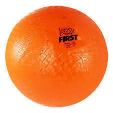

# Subsystems

Each subsystem in our robot code is in its own class, which is in its own file. For the purpose of this demonstration, we will consider one of the most simple types of subsystems we build: a roller intake. To visualize this, we will utilize our 2019 robot for the game Destination: Deep Space.


The subsystem of focus here is the green wheeled mouth system, which is our roller intake for taking in cargo balls.



Essentially, there is a single motor hooked up to those wheels, and when it is run, the intake can take in cargo balls. When it is run the other way, it will spit them out. We build these **a lot**, so if you can understand how to program this, it will greatly help.

## Basic Code

```java
public class Intake extends Subsystem {
    
    public Intake() {

    }

    @Override
    public void initDefaultCommand() {

    }
}
```

This is the basic boilerplate code for a subsystem. One thing to notice is that this `Intake` extends the `Subsystem` class, which is included in WPILib. This is necessary for `command based` to work. We want to make this in a new file called `Intake.java` and it should be inside of a folder called `subsystems`.

## Actuators

The next step is to implement the actual actuators (motors, pistons) that are on our subsystem. In this case, we have a single `WPI_VictorSPX` that controls the roller. Note that we do need the `Phoenix.json` vendor dependency and a corresponding import statement.

```java
public class Intake extends Subsystem {
    
    private WPI_VictorSPX intakeMotor;

    public Intake() {
        intakeMotor = new WPI_VictorSPX(0);
    }

    @Override
    public void initDefaultCommand() {

    }
}
```

## States

Next, we have to consider something called the `states` of the `subsystem`. Essentially, a `state` is a configuration that we could put the `subsystem` into. Let's consider the intake, which has some of the most simple `states`.

There are essentially 3 `states` of the intake:
 - NEUTRAL - doing nothing
 - INTAKING - spinning inwards to take in a ball
 - EJECTING - spinning outwards to eject a ball

## States in Code

At any time, the subsystem will have a variable that refers to the current state of the subsystem. We use an `enum` to represent this state.

```java
public class Intake extends Subsystem {
    
    private WPI_VictorSPX intakeMotor;

    public enum State {
        NEUTRAL,
        INTAKING,
        EJECTING
    }
    private State state = State.EJECTING;

    public Intake() {
        intakeMotor = new WPI_VictorSPX(0);
    }

    @Override
    public void initDefaultCommand() {

    }
}
```

## Updating our State

Now that we have a variable to represent the internal state of our subsystem, we have to be able to somehow update that state and change it. The way we do this is by creating various functions within our class that will change the state to a desired value.

```java
public class Intake extends Subsystem {
    
    private WPI_VictorSPX intakeMotor;

    public enum State {
        NEUTRAL,
        INTAKING,
        EJECTING
    }
    private State state = State.EJECTING;

    public Intake() {
        intakeMotor = new WPI_VictorSPX(0);
    }

    @Override
    public void initDefaultCommand() {

    }

    public void neutral() {
        state = State.NEUTRAL;
    }

    public void intake() {
        state = State.INTAKING;
    }

    public void eject() {
        state = State.EJECTING;
    }
}
```

We will use these functions when we go over creating commands.

## Updating

We now have a variable to represent the current state of the intake, but we aren't actually doing anything with that state. The way we actually use it is we create an `update()` function that looks at the current state and updates all of the actuators in order to reflect that current state.

In this case, we want to set the speed of `intakeMotor` depending on the state.

```java
public class Intake extends Subsystem {
    
    private WPI_VictorSPX intakeMotor;

    public enum State {
        NEUTRAL,
        INTAKING,
        EJECTING
    }
    private State state = State.EJECTING;

    public Intake() {
        intakeMotor = new WPI_VictorSPX(0);
    }

    @Override
    public void initDefaultCommand() {

    }

    public void update() {
        switch(state) {
            case NEUTRAL:
                intakeMotor.set(0);
            break;
            case INTAKING:
                intakeMotor.set(-1.0);
            break;
            case EJECTING:
                intakeMotor.set(1.0);
            break;
        }
    }

    public void neutral() {
        state = State.NEUTRAL;
    }

    public void intake() {
        state = State.INTAKING;
    }

    public void eject() {
        state = State.EJECTING;
    }
}
```

## Creating Subsystem in Robot.java

Now that we have created the class for our Intake in `Intake.java`, it is time to actually add this code to `Robot.java`. We first have to create an instance of the `Intake` and then we must utilize it.

```java
package frc.robot;

import edu.wpi.first.wpilibj.*;

public class Robot extends IterativeRobot {

    public static Intake intake;

    // Runs once when the robot is turned on
    public void robotInit() {
        intake = new Intake();
    }

    // Runs repeatedly when the robot is in teleop
    public void teleopPeriodic() {
        Scheduler.getInstance().run(); // this line is needed for command based

        intake.update();
    }
}
```

Note that we made the `Intake` variable `public static`. This is important for later, when we get into commands.

## Next Steps

Now, the overall structure of our intake is pretty well defined. Next up, we will look at how we actually go about using commands to control it.
